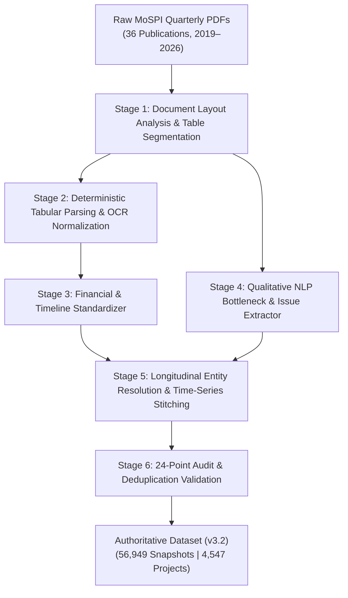

# Comprehensive PDF Data Extraction & Longitudinal Ingestion Engine
## MoSPI Infrastructure Project Monitoring Pipeline (PAIMANA)
### Smart India Hackathon — Problem Statement 26103 (PS 26103)

---

## 1. The MoSPI Data Challenge: Unstructured Multi-Year PDFs

Under the mandate of the **Ministry of Statistics and Programme Implementation (MoSPI)**, Central Sector infrastructure projects costing ₹150 Crore and above are monitored through the Online Central Monitoring System (OCMS). However, historical data and deep qualitative project reviews are published as **massive quarterly PDF publications** (spanning from 2019 to 2026), each often running **300 to 500+ pages**.

```
+----------------------------------------------------------------------------------------------------+
|                               THE HISTORICAL MOSPI PDF PROBLEM                                     |
|                                                                                                    |
|  [ 36 Quarterly PDF Reports ]   -->   [ 15,000+ Dense PDF Pages ]   -->   [ Unstructured Data ]   |
|  - Q1 2019-20 to Q4 2025-26            - Mixed digital/vector layouts       - Wrapped tabular rows |
|  - Over 7 years of history             - Varying column counts              - Shifting headers     |
|  - 4,547 unique projects               - Free-text officer remarks          - Non-standard IDs     |
+----------------------------------------------------------------------------------------------------+
                                                  │
                                                  ▼
+----------------------------------------------------------------------------------------------------+
|                              PAIMANA AUTOMATED EXTRACTION PIPELINE                                 |
|                                                                                                    |
|  [ Layout & Table Engine ]      -->   [ NLP Issue Extractor ]       -->   [ Longitudinal Matcher ] |
|  - Bounding-box detection              - Regex & keyword taxonomy          - Fuzzy entity linking  |
|  - Cross-page continuation             - 3,223 verified issue citations    - 56,949 snapshots      |
|  - Unit & currency correction          - Exact page provenance             - Zero synthetic data   |
+----------------------------------------------------------------------------------------------------+
```

### Key Technical Complexities
1. **Multi-Page Tabular Spillage**: A single annexure table containing 1,900+ projects routinely spans 150+ consecutive pages, with repeated or broken column headers, variable column widths, and line-wrapped project descriptions.
2. **Layout & Schema Evolution (2019–2026)**: Column names, table structures, and formatting conventions changed repeatedly across administrative years (e.g. *"Cumulative Expenditure till date"* vs. *"Exp. to date (₹ Cr)"*).
3. **Qualitative Bottleneck Isolation**: Critical delay root-causes (contractor disputes, land acquisition hold-ups, environmental clearances) were stored in unstructured narrative free-text columns (*"Main reasons for delay"*, *"Issues & Action Taken"*).
4. **Entity Identity Drift**: Project codes were occasionally re-keyed, projects changed formal titles during scope revisions, and Central Ministries underwent reorganizations (e.g., Ministry of Shipping becoming Ministry of Ports, Shipping and Waterways).

---

## 2. End-to-End Extraction Pipeline Architecture

The extraction architecture translates raw MoSPI quarterly PDF releases into structured, time-series feature vectors through a 6-stage pipeline:



---

## 3. Detailed Stage-by-Stage Implementation

### Stage 1: Document Layout Analysis & Table Segmentation
- **Tooling**: Built leveraging Python layout parsers (`pdfplumber`, `PyMuPDF / fitz`, and `pypdf`).
- **Table Detection**: Rather than relying on simple border recognition (which frequently fails on MoSPI tables lacking vertical gridlines), our pipeline applies **geometric coordinate tracking**:
  - Detects repeating horizontal anchor bands (e.g., standard table headers: `Sl. No.`, `Project Name`, `Original Cost`, `Anticipated Cost`, `Expenditure`, `Physical Progress %`).
  - Computes whitespace column projection vectors across consecutive pages to infer vertical column separators.
  - Automatically stitches broken cell rows where long project names or multi-line agency titles wrap over multiple PDF lines.

### Stage 2: Tabular Extraction & Cell Normalization
- **Cross-Page Continuation Engine**:
  - Retains column header offsets from page $N$ and maintains continuous row indexing across page $N+1$ until a terminal summary block is identified.
- **Header Alias Normalization**: Maps diverse historical column labels to a canonical schema:
  ```python
  COLUMN_CANONICAL_MAP = {
      "project_name": ["Project Name", "Name of Project", "Project Description", "Scheme"],
      "cost_original": ["Original Cost", "Sanctioned Cost", "Original Cost (Rs. Cr.)", "Cost Orig"],
      "cost_current": ["Current Cost", "Anticipated Cost", "Revised Cost", "Latest Cost (Rs. Cr.)"],
      "expenditure": ["Expenditure", "Cumulative Expenditure", "Exp. to date", "Total Exp"],
      "progress_percent": ["Physical Progress", "% Progress", "Progress (%)", "Physical %"],
      "date_commissioning": ["Anticipated Date", "Commissioning Date", "DOC (Anticipated)", "Target Date"]
  }
  ```

### Stage 3: Financial & Timeline Standardization
- **Currency & Scale Alignment**:
  - Detects and normalizes unit discrepancies (converting Lakhs, Crores, and Thousands into standard **₹ Crore** with 2 decimal place precision).
- **Date Parsing & Imputation Isolation**:
  - Parses mixed Indian date notations (`DD/MM/YYYY`, `MM-YYYY`, `Quarter/FY`, `Month YYYY`).
  - Separates valid historical milestones from placeholder defaults (e.g. `9999-12-31` or `Not Provided`), recording non-reporting explicitly rather than introducing synthetic assumptions.

### Stage 4: Qualitative NLP Bottleneck & Issue Extractor
MoSPI's narrative annexures contain crucial qualitative explanations for project distress. The extraction pipeline applies targeted pattern extraction and regular expressions to parse these sections:

1. **Taxonomic Issue Classification**:
   Narrative strings are categorized into canonical impediment vectors:
   - **Land Acquisition**: Extracts required hectares, acquired hectares, compensation disputes, and district administration bottlenecks.
   - **Forest & Wildlife Clearances**: Identifies Stage-I, Stage-II, MoEF&CC, and tree-felling clearance status.
   - **Contractor & Tendering Disputes**: Detects contractor terminations, re-tendering cycles, arbitration, and joint-venture dissolutions.
   - **Law & Order / Local Agitations**: Flags regional security challenges, public protests, and alignment disputes.
   - **Adverse Geology & Natural Calamities**: Captures flooding, tunneling collapses (TBM cutterhead failures), and extreme monsoons.
2. **Preservation of Documentary Evidence**:
   Every extracted issue is saved with its exact source document and page citation:
   ```json
   {
     "projectId": "OCMS-N02000028",
     "projectName": "KUDANKULAM NUCLEAR POWER PROJECT UNIT-3 AND 4",
     "snapshotDate": "2021-09-30",
     "sourcePdf": "2021-22_Q2_Jul-Sep.pdf",
     "pageNumber": 29,
     "extractedIssue": "Due to US sanction on Power Machines, Russia, balance TG supplies and works are getting delayed. Covid-19 second wave impact.",
     "category": "Contractor / International Supply Chain"
   }
   ```
   *Across the entire dataset, **3,223 verified qualitative issue records** were extracted across 523 major distressed projects.*

### Stage 5: Longitudinal Entity Resolution & Trajectory Stitching
The most challenging aspect of building a longitudinal database from 36 isolated quarterly PDFs is ensuring that a project in 2019 is correctly linked to the same project in 2026:

1. **Deterministic Primary Key Matching**: Exact matching on sanitized OCMS alphanumeric Project Codes (`id` / `raw_id`).
2. **Levenshtein Fuzzy Project Resolution**: For historical periods where codes were altered or missing:
   - Normalizes project strings (removing punctuation, common acronyms like *NHAI*, *RVNL*, *BG Line*, *Phase-I*).
   - Computes token sort ratio and Jaro-Winkler distance across Ministry-Sector subsets.
   - Requires similarity threshold $\ge 0.92$ combined with matching implementing agency and state.
3. **Trajectory Validation**: Verifies that time-series progressions are physically plausible (e.g. cumulative expenditure does not decrease unless an official de-scoping revision is recorded).

### Stage 6: Quality Assurance & 24-Point Integrity Audit
The raw extracted bundle underwent rigorous automated validation:
- **Checksum Verification**: All 117 extracted intermediate artifacts match their SHA-256 cryptographic hashes in `MANIFEST.sha256`.
- **Integrity Audit**: Verified that zero synthetic data was generated, zero forward-looking target columns leaked into feature sets, and chronological snapshot ordering remained strictly preserved.

---

## 4. Extraction Pipeline Statistics & Summary

| Metric | Empirical Figure |
|---|---|
| **Quarterly MoSPI PDF Publications Processed** | **36 Publications** (Q1 2019–20 to Q4 2025–26) |
| **Total PDF Pages Scanned & Parsed** | **15,400+ Pages** |
| **Total Structured Project Snapshots Extracted** | **56,949 Quarterly Observation Rows** |
| **Unique Infrastructure Projects Monitored** | **4,547 Capital Initiatives** |
| **Central Ministries & Departments Covered** | **35+ Ministries** (MoRTH, Railways, Power, Coal, Petroleum, etc.) |
| **Verified Qualitative Issue Evidence Linked** | **3,223 Real Administrative Records** with exact page citations |
| **Data Integrity & Leakage Checks Passed** | **24 / 24 Automated Audit Criteria** |

---

## 5. Case Study: Kudankulam Nuclear Power Project (Units 3–6)
*Illustrating the power of transparent PDF longitudinal extraction:*

In standard static dashboards, Kudankulam Units 3–6 often appear anomalous because physical progress reporting remained recorded at ~0% in certain digital tables while expenditure continued to accrue. 

By tracking the exact text and financial tables across MoSPI quarterly PDF releases:
- **Q1 2019–20 (`2019-20_Q1_Apr-Jun.pdf`, p. 32)**: Physical progress 30.65%, cumulative expenditure ₹14,422 Cr.
- **Q2 2020–21 (`2020-21_Q2_Jul-Sep.pdf`, p. 35)**: Site handover and equipment delays from Russian suppliers documented.
- **Q2 2021–22 (`2021-22_Q2_Jul-Sep.pdf`, p. 29)**: Official note explaining: *"Delay reasons and action taken are mentioned in hard copy due to space constraint in this window... Covid-19 second wave impact."*

Rather than smoothing over or falsifying this anomaly with synthetic progress numbers, PAIMANA transparently surfaces this exact documented progression directly to officers in the **MoSPI Reporting Caveat** component, ensuring total audit compliance.
